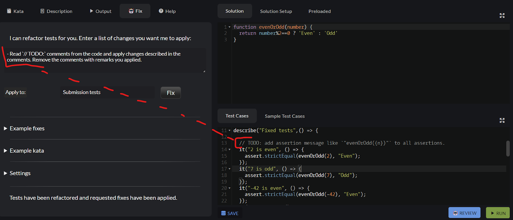
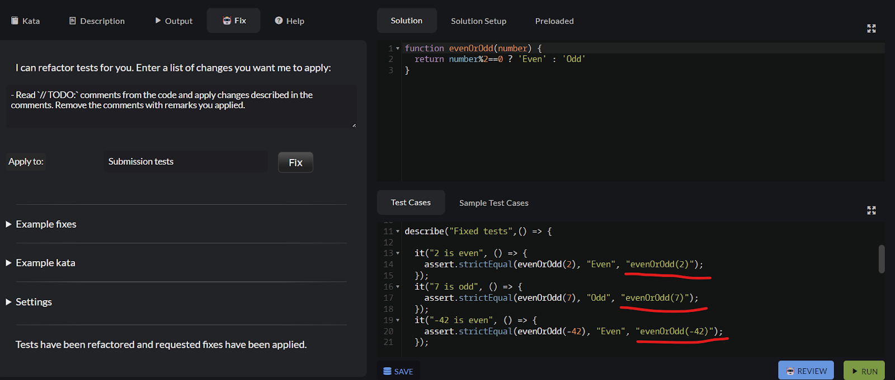

# Fixing Forks with Codot (Beta)

Codot uses its AI capabilities to assist you in fixing and refactoring forks.

## How to Use

- Open the fork editor by forking a kata, creating a translation, or editing an existing fork.
- Read through the code and judge what fixes need to be applied to bring the code up to the current Codewars quality level.
- Switch to the **"Fix"** tab in the left pane of the page.
- Enter your instructions into the input box (see [Instructions Guide](#instructions-guide)). You can click on example refactorings below the input box, and they will be appended to your current instructions. You can edit them as necessary: change placeholder names, numeric values, or make instructions more (or less) specific, etc.
- Optionally, paste a test suite that can be used as an example. You can use tests from one of the [Authoring Examples](https://www.codewars.com/collections/authoring-examples) katas or provide your own.
- Enter your secret Katafix key to submit a refactoring request. See [How to Get My Katafix Key?](#how-to-get-my-katafix-key) if you need one.

## What Katafix Is and What It Is Not

Refactoring with Katafix is intended to assist with content maintenance on the Codewars platform. It uses generative AI and large language models (LLMs) behind the scenes. As such, it is subject to the typical limitations of LLMs: responses may be inaccurate, and generated code may be incorrect, of insufficient quality, or even broken.

Katafix is _not_ a tool for creating the final, definitive version of refactored code. All code generated by the tool must be reviewed and corrected if necessary.

## What Katafix Can and Cannot Do

- **Refactoring Scope**: Katafix can currently refactor only the submission tests. Support for other snippets, such as example tests, complete solutions, descriptions, and cross-snippet refactorings (e.g., _"move test helpers from preloaded to submission tests"_) is planned but not yet available.

- **Examples**: Katafix can accept examples, but only if you manually copy them from another kata and paste them into the dedicated input box. Automation of this process is planned but not implemented yet.

- **Language Support**: Katafix can generally work with any language available on Codewars, but the quality of refactorings depends on how well the LLMs understand the given language. Fixing code in popular languages like Python or JavaScript is usually straightforward. However, support for less common languages like Haxe or Reason may be less reliable. Some languages can also be tricky - for example, LLMs often confuse Crystal with Ruby or PureScript with Haskell.

- **Tracking Changes**: Currently, when a response with the fixed code arrives, the existing code in the editor is replaced with the new code. There is no way to compare the newly generated code with the original state of the fork or with previous versions. The only way to revert a fix is by using `Ctrl+Z` (undo).

## Instructions Guide

Creating prompts for LLMs is an art in itself. Depending on the quality of your prompt, the results may range from perfect to helpful to completely useless. The more specific the instructions, the better the chances of receiving a correct response. For example:

- Very specific instructions, such as _"Rename function `my_secret_solution_43675357431` to `refsol`"_, almost always work well.
- General instructions about a specific fix, such as _"Wrap fixed tests with `it(fixed tests)`"_, or _"Implement random tests by generating inputs first, shuffling them, and then looping over them to perform assertions"_, are typically good enough for modern AI models and often yield satisfactory results. However, the generated code may still require manual correction.
- Vague or overly generic commands, such as _"Make the reference solution faster"_, or convoluted sentences with multiple _"or"_, _"and"_, and _"not"_, are likely to confuse the LLM and result in poor output.

Avoid using prompts to request trivial changes that can be easily handled within the code editor. For example, asking to _"Fix the typo in the word 'excepted' in the assertion message"_ or _"Change the title of random tests to 'Random tests'"_ will work but is inefficient and wastes tokens and API usage. Whenever possible, such minor changes should be made directly in the code editor or grouped together into a single, larger prompt.

A general guideline: if your commands can be easily understood and followed by a person, they can likely be understood by an LLM as well.

### Inline Prompts

A method that has proven to be very effective when working with Katafix is embedding prompts with code comments directly into the refactored code instead of providing them through the Katafix input box. Katafix can be instructed to read these comments and apply the refactoring described within them. For example, the following configuration of the prompt and inline comments can be used:

The above prompt will result in the following changes:

## How _Not_ to Use Katafix

Katafix uses my personal API keys and quota, and I am billed for its usage in real money. While it is not excessively expensive, overly long requests or large volumes of requests can quickly add up. Therefore, I kindly ask you to:

- Refrain from submitting overly long code snippets (either source code for fixes or examples), especially ones which would result in very large outputs. A hundred or so lines is ideal, and an occasional thousand is fine, but please avoid submitting entire books or articles.
- Use the tool only through the provided UI interface. Do not automate or script requests. If you need a tool for automated or unsupervised work with Codewars challenges, feel free to ask - I may have something suitable for your needs.
- Avoid refactoring code that is not part of Codewars kata. It might be tempting to use Katafix for personal or work projects, but please do not.
- Do not ask Katafix for unrelated tasks, such as _"Tell me a joke"_ or _"Give me a recipe for a pie"_, as they are outside the scope of Katafix.
- Do not share your Katafix key with others.

Feel free to use the tool extensively for its intended purpose, such as fixing large numbers of Codewars kata, even if this generates a significant number of requests. If you encounter usage limits that slow you down, let me know, and I may adjust them for you.

Abuse of the tool - particularly behavior that rapidly exhausts my API tokens - may result in the tool being taken offline for everyone, which would be unfortunate. :(

## How to Get My Katafix Key

To obtain a Katafix key, contact the author of the script (me) on Codewars Discord and request one. Treat your key like a password: keep it secure and do not share it.

During the testing phase, keys expire after two weeks. If your key expires, simply request a new one.

## Note on Availability

The tool is under active development and may change or go offline at any time for an undetermined period. Keys may also be invalidated without prior notice. No guarantees are provided.
