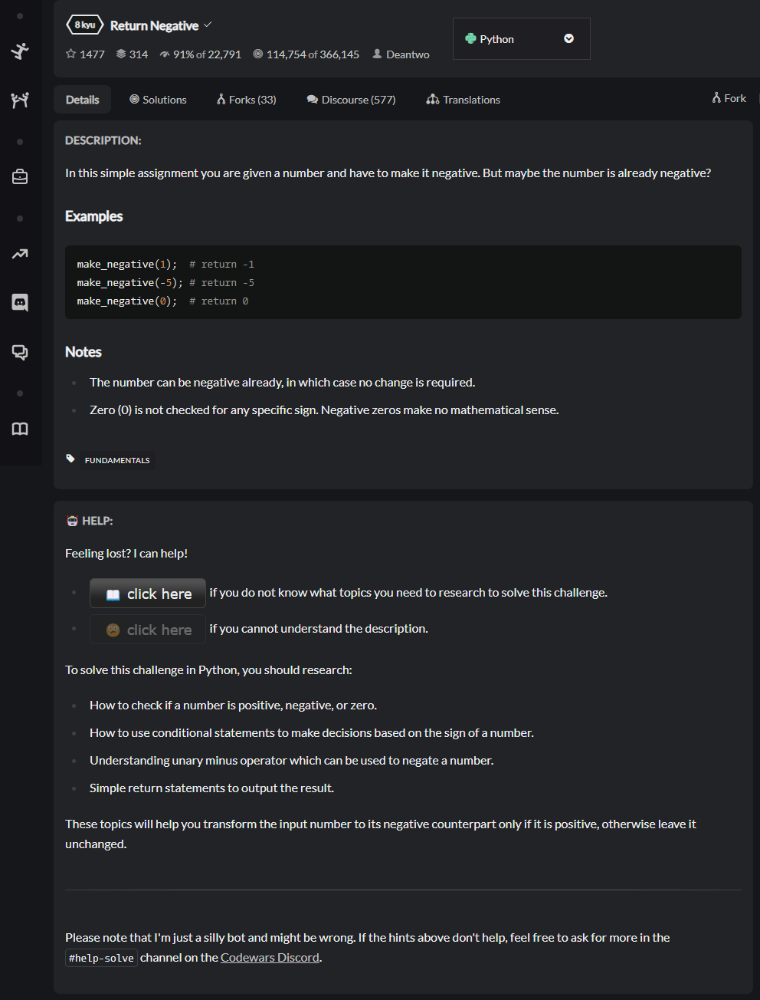
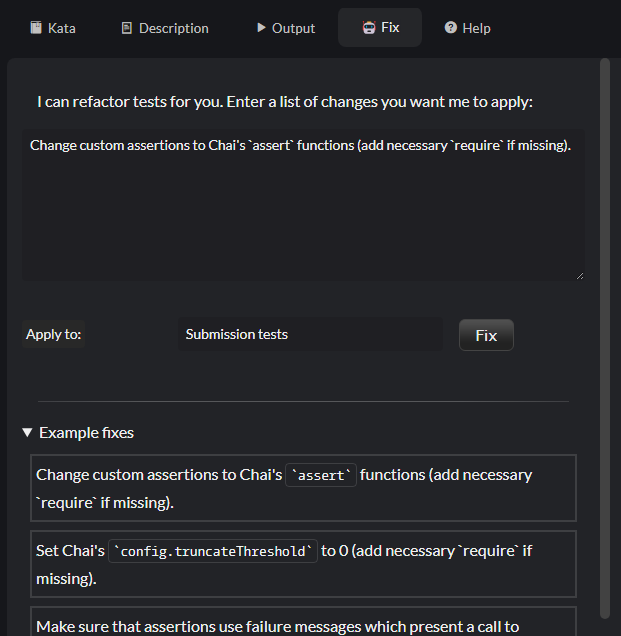

# Codot Client

This is a userscript client for the Codot AIssistant.

## What is Codot?

Codot is short for **Cod**ewars B**ot**. It's a GPT-powered assistant designed to help users of the Codewars platform as they embark on their journey with Codewars kata.

## Installation

Codot is a userscript compatible with [Tampermonkey](https://www.tampermonkey.net). To install it, first add the [Tampermonkey extension](https://www.tampermonkey.net) to your browser. If you encounter issues, check the [Tampermonkey FAQ](https://www.tampermonkey.net/faq.php); some browsers may require [Developer mode](https://www.tampermonkey.net/faq.php#Q209) to run userscripts. Next, install the [Codot userscript](https://github.com/hobovsky/codot-client/raw/main/src/codot.user.js) in Tampermonkey. After installation, refresh the Codewars page.

## Features

Codot offers a set functions to support you with solving Codewars kata, like help with failed tests, perform a code review, run code style tools on your solution, refactor code of tests.

Additionaly, threre is one function in beta phase: review of kata and translations.

### Help with failed tests

Codot offers his help when you are training on a Codewars challenge and your tests (either sample tests or a submission attempt) end in failure. Upon a request for help, Codot will take some time to think. Please note that the bot's intelligence is artificial, so figuring out the answer may take some time - around 10 seconds of intensive thinking. After a short while, Codot will present you with some hopefully helpful hints.

### Hints for learning and research

Codot provides beginners with spoiler-free guidance on what topics to research in order to solve a challenge.

### Run style check tools

_**Note:** currently, style checks support only Python and JavaScript code._

Codot can run stylechecks and linters on your solution and report code smells, potential code issues, bugs, and security problems.

### Code reviews of solutions

Codot can perform reviews of your solution and raise remarks about style, practices, used algorithms, etc.

### Fixing forks

Codot can assist you with introducing fixes to forks. See [Fixing README](README.fixing.md) for details.

### Reviews of kata and translations (beta)

Codot can perform reviews of your kata and translations for conformance with Codewars quality guidelines.

### Accuracy and effectiveness

Codot is a tool in a very early phase, based on AI utilities, and as such, it is very likely that results produced by it are not accurate, clear, understandable, or even helpful at all. Its prompts and configs still require a lot of fine-tuning to produce more helpful, accurate hints.

Linting feature uses default configs which might not be suitable for code of solutions of Codewars problems. Rulesets can be tuned if the feature will be considered interesting for users.

Reviews for conformance with Codewars quality guidelines are in early beta testing phase. The suggestions are roughly accurate, but should be taken with a grain of salt, and ideally consulted with Codewars community. AI prompts are to be tuned to result in better answers.

### Limits

During the initial testing phase, there are specific limits in place:

- For the **"help"** and **solution review** functions: The limit is 1 query per minute and a maximum of 5 queries per hour for a single user ID.
- For the **"kata review"** function: The limit is 1 review per 10 minutes and a maximum of 5 reviews per 3 hours for a single user ID.

These limits may be increased after the initial testing phase.

To minimize spoilers, Codot does not help with failed tests for kata ranked higher than 6 kyu or beta kata.

## Note on Availability

Currently, Codot utilizes my private OpenAI quota and a free hosting service. It's possible that my API quotas could be exhausted at any time, or that my billing plan could run out, or that the service could go down without my notice, or that I may decide to discontinue payment for it. Therefore, there are absolutely no guarantees.

## Disclaimer

The creator of Codot and author of this script is a member of the Codewars moderation team. However, please note that the script provided here is not an official part of the Codewars platform, nor is the author an employee of, nor otherwise officially affiliated with, the organization behind Codewars. This script is an independent project aimed at helping newcomers to avoid newbie mistakes when solving Codewars kata. Any use of this script is at your own discretion, and the author cannot guarantee its accuracy or suitability for your needs. Please use it responsibly and in accordance with Codewars' terms of service.
